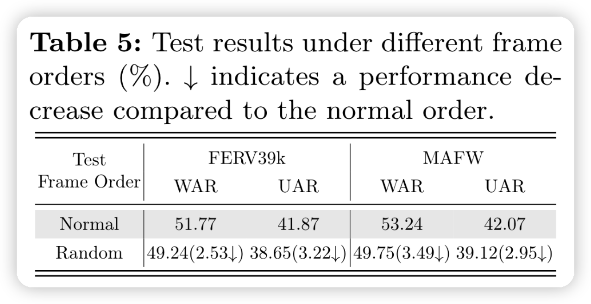

## “A3lign-DFER: Pioneering Comprehensive Dynamic Affective Alignment for Dynamic Facial Expression Recognition with CLIP”
([Tao 等, 2024, p. 1](zotero://select/library/items/5Z6UEAFF)) ([pdf](zotero://open-pdf/library/items/C5E2D442?page=1&annotation=Y6APSAB8))

### 1、Abstract
>简介：
CLIP是基于text-image训练的，做的是文本图像对齐。而DFER中视频输入的动态性和标签的抽象性，给CLIP在DFER中的对齐带来了挑战。为了利用CLIP的强大表征能力，本文提出多个模块，实现了三个关键方面的对齐：情感、动态和双向。我们用可学习的多维对齐标记（MAT）替换输入标签文本，从而能够在情感和动态维度上将文本与面部表情视频样本对齐。在CLIP特征提取之后，我们引入了联合动态对齐同步器（JAS），进一步促进时间维度上的同步和对齐。此外，我们还实施了双向对齐训练范式（BAP），以确保两种模式的参数训练逐步稳定。一系列实验结果证明了有效性。

### 2、Introduction
>DFER 带来的特征对齐挑战：
>- 1.表情是抽象的概念
>- 2.动态表情视频包含童泰的元素，更困难

几种不同的DFER方式比较：

与传统的特征对齐不同，本文在 情感、动态和双向 进行对齐。
分别对应
- The learnable Multi-dimensional Alignment Tokens (MAT)  多嵌入对齐token
- Joint Dynamic Alignment Synchronizer (JAS)
- Bidirectional Alignment Training Paradigm (BAP)

### Methods
网络结构如下图

#### MAT
使用prompt learning方法，加入的tokens都是可以学习的。

其中每一个元素（token）表示为

第i类的第j句话描述对应的特征：

相比于一般的 基于prompt 方法，多了一个维度（paragraph, 及多个句子）。变相增加了可以学习的参数量
生成时间对应的图像和Text特征
#### 2、Joint Dynamic Alignment Synchronizer （JDA）
- **Dynamic Alignment Synchronizing** 

特征通过Dynamic编码器， 获得时特征

计算video和每个类别的prompt特征的相似性

最终结果通过Softmax得到：

>[!question]
>Module Synchronization 怎么没有介绍

### BAT 训练范式
全程冻住Clip的Text Image encoder
1、第一阶段：首先将MAT和视频帧输入Text和Image编码器，然后将图像帧特征沿着时间维度做平均，将文本特输入文本动态编码器，获得一些列的视频和人本特征。然后计算相似性，训练MAT和文本动态编码器。
2、第二阶段：冻住MAT和文本编码器，将经过CLIP得到的图像特征经过图像动态编码器编码，计算相似性，训练图像动态编码器。
3、第三阶段就是把MAT和文本，图像动态编码器都加入训练，联合训练

### 实验
数据集：FERV39K, MAFW, DFEW

实现细节：
    1、首先做了人脸的detection
    2、图像resize到120x120, random cropping 112x112
    3、3090Ti, pytorch
    4、训练了40+30+30个epoch
    5、SGD 优化器， batchsize=64, ViT-B/32, ViT-L/14 （两个模型是什么意思，最后汇报的结果也没有说是哪一个模型的）
    6、S=16,T=64 (16句子, 每句64个token)

>[!question]
>ViT输入的图像不应该是224x224吗？112x112不会破坏特征吗？

**实验结果**

与之前的CLIP-based的方法有了巨大提升，但是没有与最新的sota方法比较

**消融实验**

**可视化**

### 一些看法
1、本文采用的prompt方法对之前的prompt的扩展，增加一个维度去匹配video的时间维度是不错的想啊
2、不同与CLIP-based的方法，本文并没有重新训练CLIP的encoder
3、感觉实验细节不够详细（也许是我漏了）
4、验证*学习到时间维度信息*的消融实验方法值得学习，直接打乱输入的frames的循序
